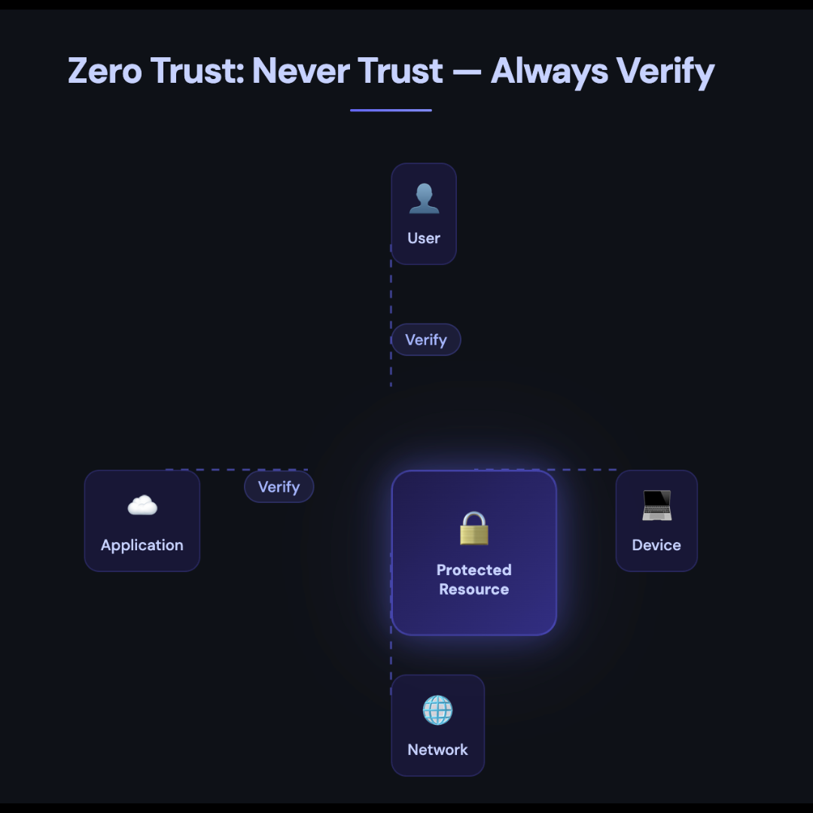

# Cybersecurity, AI & Human Risk - Applied Learning & Insights

*This repository reflects applied learning and thinking as I build in cybersecurity, AI, and human risk.*

---

## Overview
I am currently transitioning into cybersecurity with a focus on Security Awareness, GRC, and AI-related risk.

With 27+ years in education, curriculum design, and systems implementation, I bring a strong foundation in communication, training, and structured thinking, and I am actively building technical knowledge in cybersecurity.

---

## Current Areas of Focus
🔐 ISC2 Certified in Cybersecurity (CC)  
🛡️ CompTIA Security+  
🤖 AI and Cybersecurity Risk  
📊 Governance, Risk, and Compliance (GRC)  
🧠 Security Awareness and Human Behavior  

---

## Current Work
- Notes and reflections on foundational cybersecurity concepts  
- Analysis of AI-related risk and governance considerations  
- Synthesis of learning from conferences, webinars, and community engagement  

---

## Zero Trust (Simple Breakdown)

  

*This visual reflects how I think about Zero Trust - not just as a technical model, but as a framework for understanding and communicating risk across users, devices, networks, and applications.*

**Key Idea:**  
Never trust, always verify - every user, device, and connection.

**What this means in practice:**  
- No automatic trust based on location (inside or outside a network)  
- Every access request must be verified  
- Access is limited based on what is needed (least privilege)

**Why it matters:**  
Zero Trust reduces the risk of unauthorized access, especially in environments where users, devices, and data are distributed.

This concept is especially relevant as organizations move toward cloud-based and distributed environments.

---

## Purpose
To build a body of work that demonstrates the ability to translate cybersecurity concepts into meaningful, practical understanding for organizations and people.
